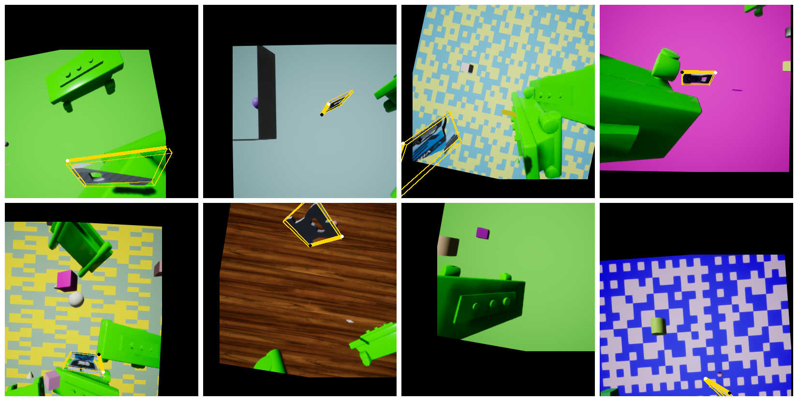
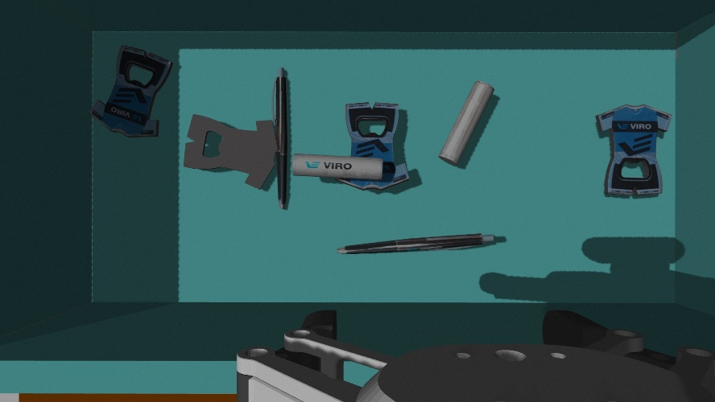
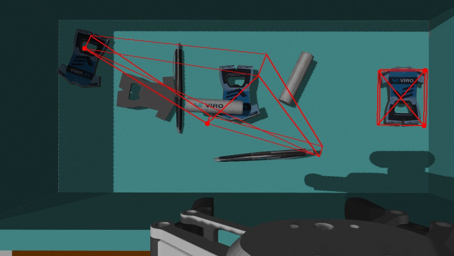
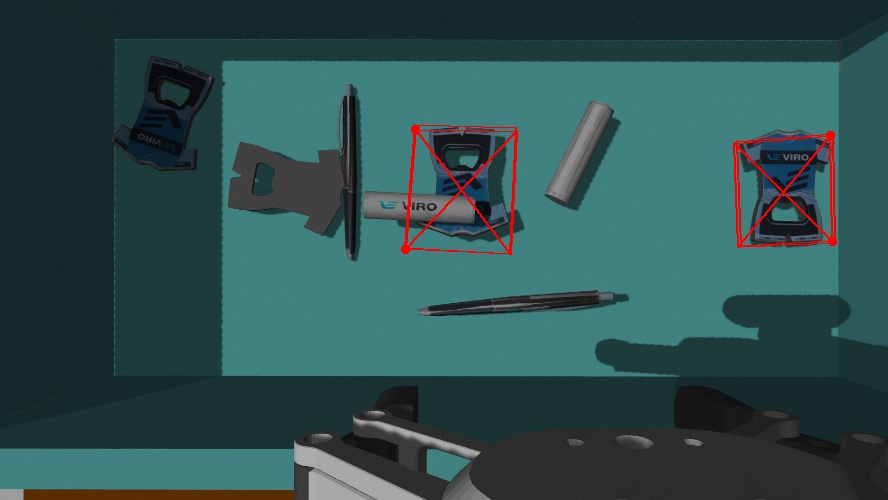
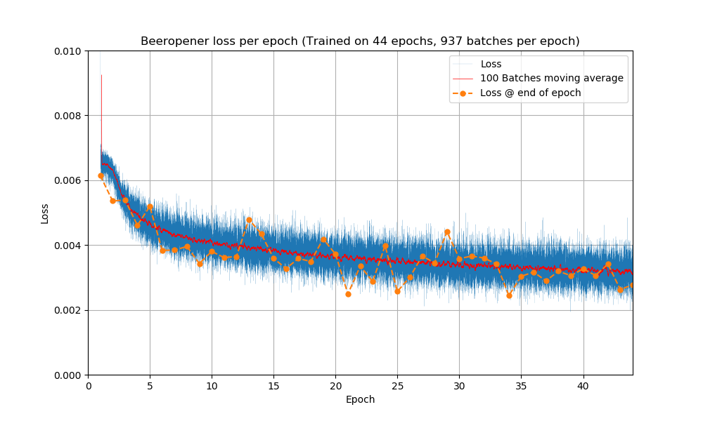
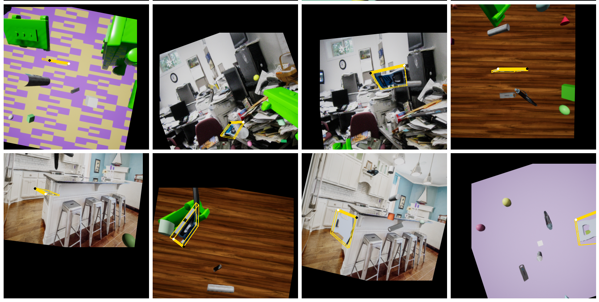
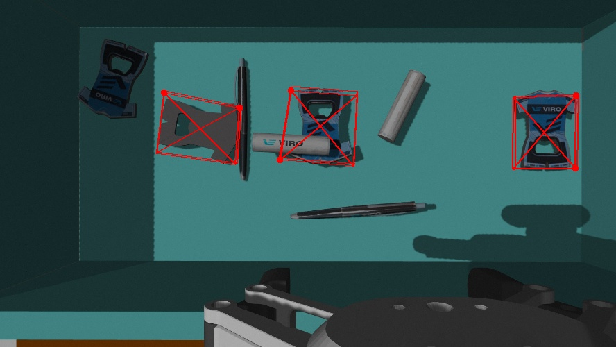
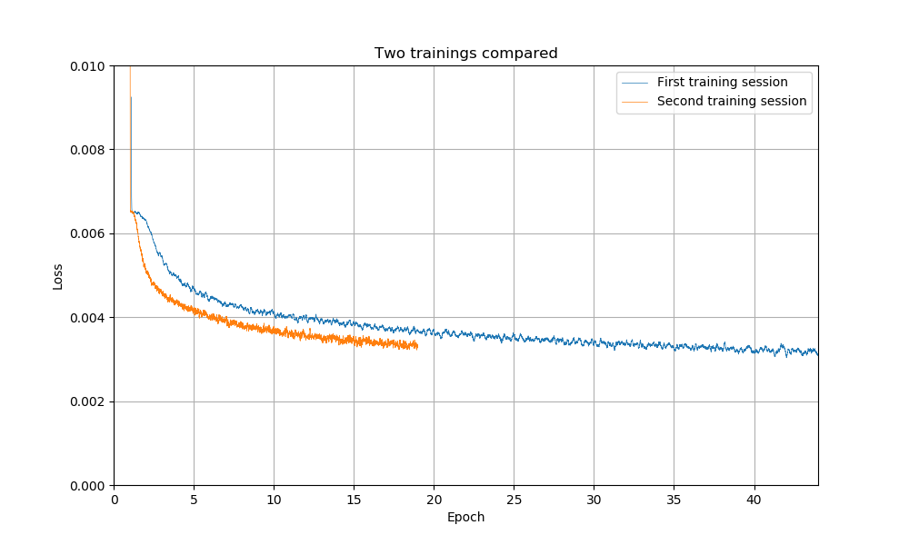
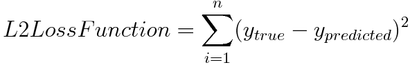

# Analyzing DOPE Training
This document describes our experience in training DOPE to detect new images.

### First dataset
To train DOPE to detect new objects, it is necessary to create a robust dataset. For this project [NNDS](NNDS%20Tutorial.md) was used to generate the dataset. For the first training session, a dataset of 30.000 domain-randomized images were used. A subset of these images is shown below. Note that the distortion that can be seen does not have to be present in the dataset. The distortion is automatically applied before the trained dataset is used.

The training on this dataset was run for 44 epochs[^1]. In the images below it shown that the longer the AI is trained on the dataset, the better the AI becomes at detecting objects.

| Detection after 11 epochs | Detection after 22 epochs |
| --- | --- |
|  |  |

| Detection after 33 epochs | Detection after 44 epochs |
| --- | --- |
|  |  |

However, the detection still wasn't good enough. The beeropener that is on the left still isn't detected. This happens because the beeropener is placed in the shadow of the bin. It would be possible to train more and more on this dataset. But before this was done, the loss[^2] off the training was checked. This can be seen in the graph below. What can be seen is that the graph flattens out or, in other words, the improvement per epoch becomes less.

It was concluded that more training on this dataset would not be very benificial anymore and that it would be better to make a new, improved, dataset.

### Second dataset
The second dataset contained 40.000 domain-randomized images, and 10.000 foto-realistic images. This still isn't close to the 60.000 domain-randomized images and 60.000 foto-realistic images the autors of DOPE suggest, but the GPU that is accessible for this project isn't fast enough. Training on such a big dataset would take weeks. Therefore the dataset was still kept smaller. The lightning on the domain-randomized images was also tuned more aggressive, so there are more darker images to (hopefully) improve the AI's performance in shadows. A subset of the images is shown below.

The AI was again tested, but only after 18 epochs. However, the AI is able to detect the same objects the previous AI was able to detect at 44 epochs.

Sadly, the AI is still not able to detect the beeropener in the shadow. Hopefully with more training this will become possible. 

The loss values of this training session are also a bit better than the first session. However, the curve still flattens out, so improvements to the dataset can still be made.

### Recommendations
It is recommended that the dataset is extended to the 60.000 domain-randomized images and 60.000 foto-realistic images. This will make the AI perform better. It is also recommended to include images in wich the desired object is close to the camera. Currently DOPE is not able to reliably detect objects when they are very close.

[^1]: One epoch is one training on all the data

[^2]: The loss used for DOPE is the L2 Loss and is defined as follows:

Note that the loss only says something of the performance of the AI on the dataset that it is training on. A bad dataset can still have good loss values. It cannot be said that one AI is better than another AI because the loss value is lower.

Read next:  
[Configuring DOPE](Configuring%20DOPE.md)