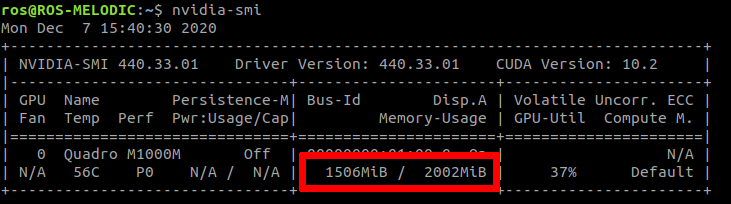

# Running DOPE on still images
When DOPE is doing inference on camera frames it uses a lot of the systems processing power. If the system is not powerfull enough it might not even run. To overcome this issue, it sometimes is possible to run DOPE on seperate images.

## Preparation
### System preparation
Close all programs that you currently do not need. This frees up video memory. You can check the amount of available video memory by typing the following command in a console:
```bash
$ nvidia-smi
```
Some information about your graphics card as well as program using it will show up:



The area marked in red shows the currently used video memory. In our experiments, we needed at least 1500 MiB of free memory in order to run DOPE. If you do not have enough memory free, you can try and close programs that are listed in the output under processes.

If the command does not run at all, you might not have the Nvidia Cuda drivers installed. See [installation](Installation.md) for the links on how to install them.

### File preparation
Put all the images that you want analyzed in a single folder. Also put a `yaml` file next to them that describes the camera that was used to make these pictures. If you don't have these settings, you put the following text in a file:

```yaml
!!python/object/new:sensor_msgs.msg._CameraInfo.CameraInfo
state:
- !!python/object/new:std_msgs.msg._Header.Header
  state:
  - 2
  - !!python/object/new:genpy.rostime.Time
    state: [53, 976000000]
  - camera_link
- 1080
- 1920
- plumb_bob
- !!python/tuple [0.0, 0.0, 0.0, 0.0, 0.0]
- !!python/tuple [1144.0874006434067, 0.0, 960.5, 0.0, 1144.0874006434067, 540.5,
  0.0, 0.0, 1.0]
- !!python/tuple [1.0, 0.0, 0.0, 0.0, 1.0, 0.0, 0.0, 0.0, 1.0]
- !!python/tuple [1144.0874006434067, 0.0, 960.5, -80.08611804503848, 0.0, 1144.0874006434067,
  540.5, 0.0, 0.0, 0.0, 1.0, 0.0]
- 0
- 0
- !!python/object/new:sensor_msgs.msg._RegionOfInterest.RegionOfInterest
  state: [0, 0, 0, 0, false]
```

If you have used the pose estimation video script (as described in [this](Pose%20estimation%20video.md) tutorial), you will also have a file for the camera that was used for those pictures.

### Using DOPE
In order to send seperate images to DOPE, we use a [custom script](../triple_s_util/scripts/images_to_dope.py) that must be launched using the launchfile [`images_to_dope.launch`](../triple_s_util/launch/images_to_dope.launch). It can be started by using the following command:

```bash
$ roslaunch triple_s_util images_to_dope.launch
```

However, it might be necessary to configure some parameters first:

| Parameter | Valid values | Default | Explanation |
|---|---|---|---|
| `path_origin` | Path to a folder | `$(find triple_s_util)/local_resources/raw_images` | The location of the images that have to be analyzed |
| `path_save` | Path to a folder | `$(find triple_s_util)/local_resources/dope_images` | The output folder of the analyzed images |
| `file_extension` | `jpg|png|jpeg` | `jpeg` | File extension of the images that have to be analyzed |
| `dope_topic_publish` | ROS topic name | `/dope/webcam/image_raw` | The topic on which images should be published to be analyzed |
| `dope_topic_publish_info` | ROS topic name | `/dope/webcam/camera_info` | The topic on which the camera information must be published |
| `dope_topic_subscribe` | ROS topic name | `/dope/rgb_points` | The topic on which DOPE publishes the analyzed images with cuboids |
| `camera_info_filename` | `yaml`-file | `camera_info.yaml` | The file in `path_origin` that describes the camera |
| `start_dope` | `boolean` | `true` | Start a DOPE instance. If set to false, DOPE must be started manually |
| `config` | Path to a file | `$(find triple_s_util)/config/dope.yaml` | The DOPE configuration file |

Once it starts running it will show a message in the console when an image was saved. Once it has printed `Finished!` you can exit the terminal.

### Saving results in a rosbag
While this script is running, not only the images are published by DOPE, but also all the other information that is has gathered. It might be usefull to save this in a seperate [ROSbag](http://wiki.ros.org/rosbag/Commandline) file. This allows you to resend these messages, without actually having to run DOPE.

Read next:  
[Result from DOPE](Result%20from%20DOPE.md)