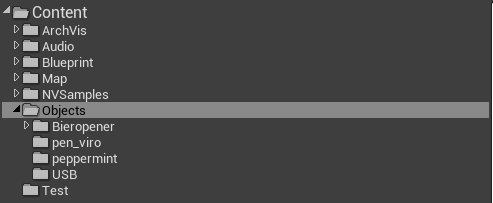
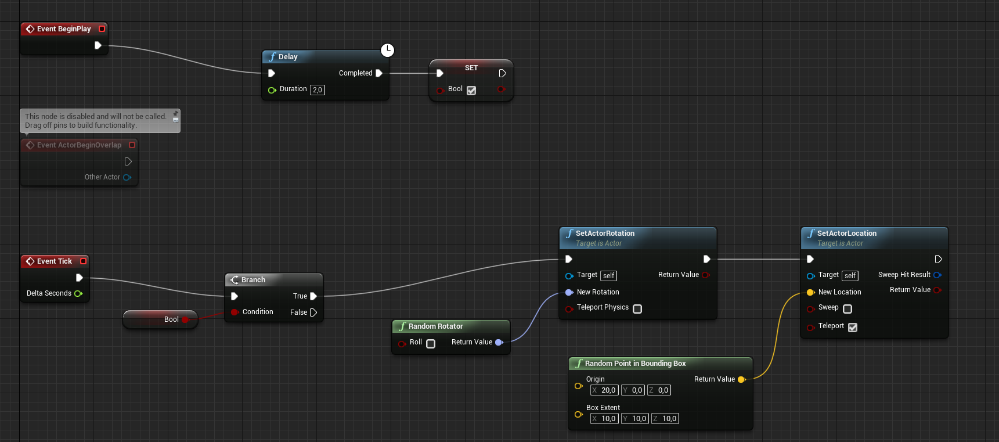
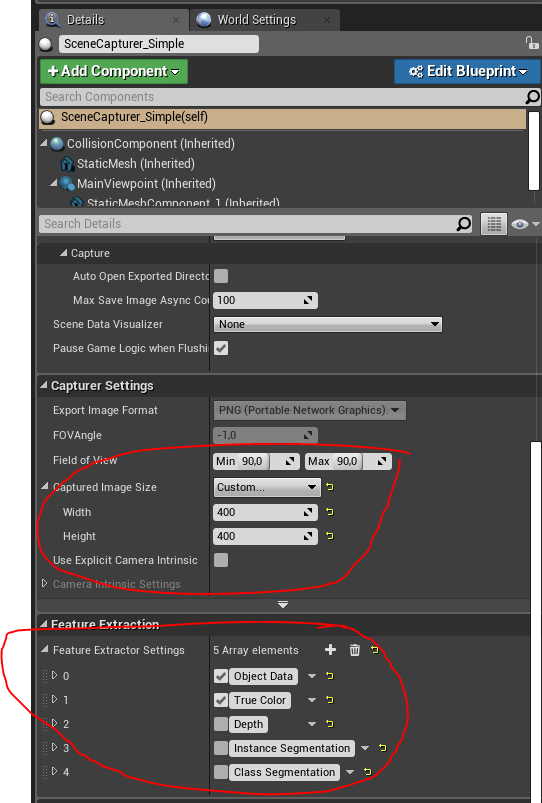

# NDDS tutorial

By following the original tutorial found [here](https://github.com/TripleSBinPicking/bin_picking_environment/blob/master/documentation/resources/NDDS.pdf), most things will be explained. In this file there will be some additions to the tutorial for points that are not clear or things that are unnecessary.

## Installation
In step 1, the original writers want you to get the file via GitHub lfs, but this does not work at the time. So for an alternative we provide a compressed version of the code [here](https://github.com/NVIDIA/Dataset_Synthesizer/releases/download/1.2.2/ndds_1.2.2.zip).

## Starting NDDS
To start NDDS just open the NDDS.uproject file that is in the \Source directory of the NDDS folder.

## Making your own synthetic dataset
To make your own synthetic dataset for use with DOPE, there are a few things to keep in mind.
### Making the level
For making the level, the original tutorial can be followed from page 12.

### Adding your own objects
Adding your own objects into the project is rather easy. First make the object a 3D modelling software of choice and export it as an .fbx file. We used Blender to model our objects. 
Then drag it into a separate folder and accept the import popup. An example for a folder structure is shown in the figure below. Here we have added a folder under Content named Objects in which separate folders for each object is made. 
After this, you can drag the object into the map and in front of the camera. Try to position it in a way that the scene capturer has a good view on it. 

### Adding random movement and rotation to objects
To add the random movement and rotation to objects we will use a blueprint. Click on one of the objects that you want to use and select the blue button with "Blueprint/Add Script".  This button can be found on the right side of the screen in the details tab. A window wil open prompting you to save the blueprint somewhere. Do this and select "Create Blueprint". Another window will open and shows the blueprint that is now linked to your object.
Create the blueprint shown below. Blueprint components can be added by right clicking on the surface and typing the name of the component you want to add. 
When the level is played, NDDS saves the regular fixed model transform to the object_settings.json file. To prevent this fixed transform from being disturbed, we implemented a 2 second delay befor starting to move and rotate the objects.

### Export options for training with DOPE
This dataset synthesizer offers many options regarding different types of data it will generate. To train an AI with DOPE, only two types of data are needed: Object Data and True Color. To make sure only these two data types are exported, go to the SceneCapturer_Simple in the World Outline and select it. Scroll down in the Details tab untill you reach the Feature Extraction array. Then deselect all array elements except for Object Data and True Color.
Another important setting that must be changed is the Captured Image Size. This setting can be found under Capturer Settings, also in the Details tab, and then under Captured Image Size. This has to be set to 400 x 400 pixels, because DOPE only takes this format for training.

Read next:  
[Training DOPE](Training%20DOPE.md)
