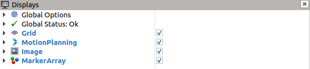
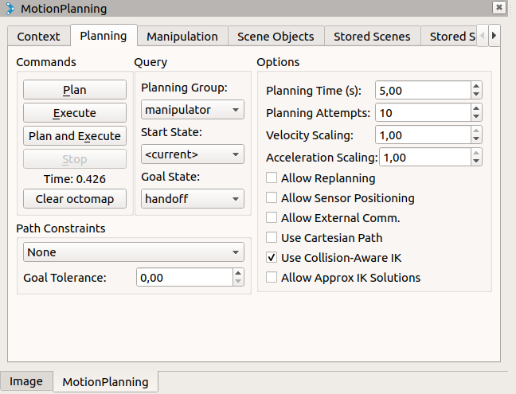
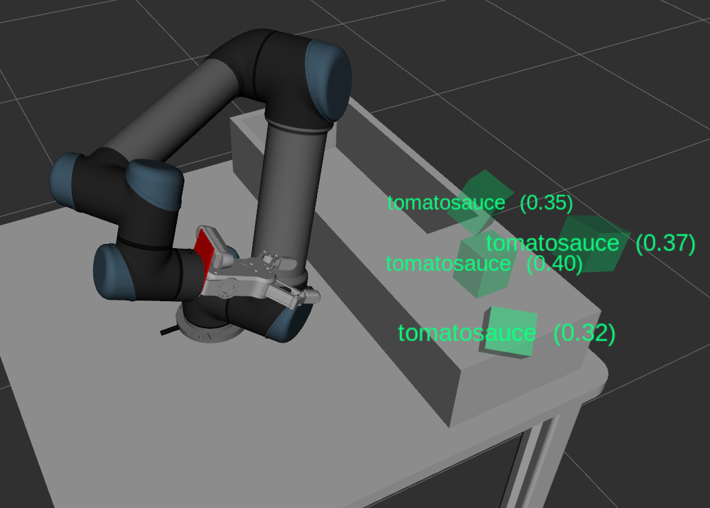

# Planning Environment Explanation
This document describes what the [planning environment launchfile](../triple_s_util/launch/planning_environment.launch) does. The planning environment launchfile is the main launchfile for controlling the UR5 robot. It has the option to start and control the real robot, as well as a simulated robot.

## Starting the planning environment
Starting the planning environment is quite easy:
```
$ roslaunch triple_s_util planning_environment.launch
```

### Parameters
The launchfile has a few parameters. They can be used by adding `<parameter name>:=<parameter value>` to the launch command.

| Parameter | Valid values | Default | Explanation |
|---|---|---|---|
| `limited` | `true` or `false`  | `true` |Limit joint movement to `[-pi, pi]`. This makes it easier for MoveIt to plan movements, but sometimes causes weird movements |
| `sim` | `true` or `false` | `false` | Enable or disable the simulation. If the simulation is running, no real robot can be controlled |
| `paused` | `true` or `false` | `false` | Start the simulation paused |
| `gui` | `true` or `false` | `true` | Launch the Gazebo simulation UI (simulation only) |
| `robot_ip` | Ipv4 address | `172.16.0.10` | Ip address of the real robot (real robot only) |
| `camera_on_robot` | `true` or `false` | `true` | Launches the robot with the camera connected to the robot. If set to false, the camera is static in the world |
| `gripper` | `rg2`, `robotiq` or `none` | `rg2` | The gripper to put on the robot |
| `poses` | Path to `srdf` file | `triple_s_util/config/poses/test_sim.srdf` | Path to an `srdf` file that contains pose definitions |
| `environment` | `saxion` or `viro` | `saxion` | The environment to put the robot in. If the `viro` environment is loaded, make sure to copy all of the [table model files of Teams](https://teams.microsoft.com/_#/school/files/Automated%20Bin%20Picking%20with%20a%20Cobot?threadId=19%3A5da6c3f517af41d690e7a41124fc332f%40thread.tacv2&ctx=channel&context=VIRO%2520Table%2520Gazebo&rootfolder=%252Fteams%252Fo365-team050700-AutomatedBinPickingwithaCobot%252FShared%2520Documents%252FAutomated%2520Bin%2520Picking%2520with%2520a%2520Cobot%252FSolidworks%2520Models%252FVIRO%2520Table%2520Gazebo) (`Automated Bin Picking with a Cobot/Solidworks Models/VIRO Table Gazebo`) and place them in the `triple_s_util/meshes/viro` folder. |

## How it works
The launchfile uses lots of other launchfiles, which each have some use for the robot.

The first launchfile that is imported is [gazebo_ur5_gripper.launch](../triple_s_util/launch/gazebo_ur5_gripper.launch). This file is only loaded when a simulated robot is used, and it does the following things:
 - Startup an empty Gazebo world. [Gazebo](http://gazebosim.org/) is the simulation program that is used.
 - Load our robot configuration to the [ROS parameter server](http://wiki.ros.org/Parameter%20Server).
 - Spawn our robot configuration in Gazebo
 - Start the simulated robot controller
 - Start the simulated UR5 joint controllers
 - Start the simulated gripper controllers

If the real robot is used, and not a simulated robot. The following launchfile is first loaded: [physical_robot.launch](../triple_s_util/launch/physical_robot.launch). It does the following things:
 - Load our robot configuration to the [ROS parameter server](http://wiki.ros.org/Parameter%20Server).
 - Create a node that can publish the robot state
 - Launch the UR5 driver

Once a robot is running (either in a simulation, or a real robot), [MoveIt](https://moveit.ros.org/) is launched. MoveIt will plan all the movements of the robot.

A [semantic robot description](http://wiki.ros.org/srdf) is also loaded on the ROS parameter server. The semantic robot description contains joint groups, named robot poses and other configuration settings for the robot.

Finally, [rviz](http://wiki.ros.org/rviz) is started. Rviz can visualize what the robot is doing, and what is going to do.

## Using Rviz
The main goal of Rviz is to visualize what is happening in all the scripts that are running. In the display window on the left of the screen you can see the different displays that rviz is currently showing.



The first three options are not that interesting and are just there to make Rviz run. However, the next three displays can be very useful.

### Motion Planning

The motion planning display is used to show information about the current position and the movement planning of the robot. These things are visible in the 3D view on the right of Rviz. It is also possible to move the robot to a position using this display. There three robots visible:
 
 1. A normal colored robot. This is the current position of the robot
 2. A orange colored robot. This is the robot you can move around in Rviz. It is also possible to move the actual robot to the position (this is explained later)
 3. Multiple purple colored robots. This is the path of the robot that is going to take to reach its destination goal

In the screen on the bottom left you can manipulate the robot movement planning.



There are a lot of options, but the two most interesting are the buttons under *Commands* and *Query*.

Command buttons:
 - *Plan* will calculate the motion the robot will have to make to move the robot to the orange colored robot
 - *Execute* will execute said plan
 - *Plan and Execute* will do both of those tings
 - *Stop* will stop the motion of the robot

Query buttons:
 - *Planning Group* can determine the joint group for which a planning should be created. Should be left on *manipulator*
 - *Start State* can set the start location of the path that the robot is going to take. Should be left on *\<current\>*
 - *Goal State* can set a predefined location to create a planning to. More locations can be added using the `poses` parameter. (As described in [parameters](#parameters))

A lot of other options are available, but are not used for this project.

### Image
The second display that is used is the Image display. This display shows the current camera view. It can be enabled by clicking *Image* in the bottom left of the screen (next to *MotionPlanning*). If the camera that is used runs on another topic, it can be changed by expanding the Image dropdown under *Displays* and changing the *Image Topic* value to the desired topic.

### MarkerArray
The third display is a MarkerArray display. This display is used to visualize were the detected objects are in the Rviz environment. If objects are detected they are displayed in the 3D view, as shown in the image below.



The value that comes after the name of the object is a value between zero and one and shows the confidence that DOPE has that the object is at that location (zero is not confident, one is absolutely sure).

Read next:  
[Connecting ROS to UR5](Connecting%20ROS%20to%20UR5.md)  
[Creating robot poses](Creating%20robot%20poses.md)