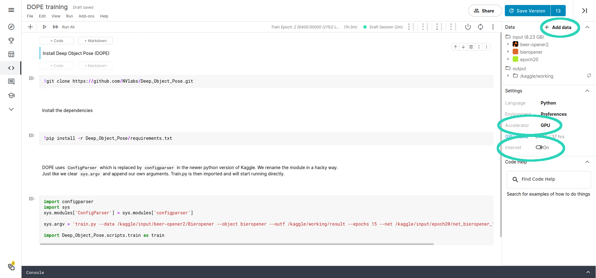

# Training DOPE
The Deep Object Pose Estimation (DOPE) AI is an artificial intelligence designed by Nvidia. It can do 6D pose estimation of objects in images. 6D pose estimation is estimation the transformation (x, y, z) and rotation (roll, pitch, yaw) of an object with respect to the camera. In order to detect objects, it is needed to train the AI on how to detect those objects. This document describes how this can be done.

DOPE needs a very powerful NVidia graphics card in order to train. If you don't have such a graphics card available, it is possible to use the online service [kaggle](https://kaggle.com). Kaggle is an online Jupyter notebook/Google Colab like service and gives you access to a NVidia graphics card for 37 hours per week. 

### Running locally
It is assumed that you have already cloned this repository as per the instructions in the [readme](../readme.md), and that CUDA is installed on your system. You also need your dataset.
```bash
rosrun dope train.py --data <path to dataset> --object <object to train> --outf <path to output folder> --epochs <number of epochs>
```
The relevant parameters are explained in more detail in the following table:
| Parameter Name | Example value | Explanation |
| --- | --- | --- |
| data | `/path/to/dataset` | The path to the dataset to train on. It must contain the images to train on, as well as a json file for each file that contains the pose of the object to train on |
| object | `bicycle` | The name of the object to train on. This _must_ be a lowercase name! Even if the name of the object in the json file has capitalized letters |
| outf | `/path/to/dataset-output` | The output folder. The `.pth` files will be placed here |
| epochs | `30` | The amount of epochs to train for. One epoch is one training session on all the data. More epochs will take more time, but also lead to a better trained AI. After each epoch, an `pth` file is created |
| _The following parameters are not required_ |
| save | `true` | Save a batch of images with the cuboids draw on it to validate the dataset |
| net | `/path/to/epoch.pth` | Path to a `.pth` file to continue training |

So, in order to run for 60 epochs the entire command could be:
```bash
rosrun dope train.py --data /path/to/dataset --object bicycle --outf /path/to/output --epochs 60
```
Once the command is run the AI will start training on the new object. After each epoch a `.pth` is created in the directory specified using `--outf`. Place the file of the heighest epoch in `Deep_Object_Pose/weights` in order to use it.

### Running on Kaggle
In order to run on Kaggle some modifications will have to be made. Some of these modifications are a bit _hacky_, but that is necessary because DOPE is not intended to run on Kaggle.

Insert the following code into a Kaggle code field:
```python
!git clone https://github.com/NVlabs/Deep_Object_Pose.git
!pip install -r Deep_Object_Pose/requirements.txt

import configparser
import sys
# DOPE uses an outdated name for the configparser
sys.modules['ConfigParser'] = sys.modules['configparser']

sys.argv = 'train.py --data /kaggle/input/beer-opener2/Bieropener --object bieropener --outf /kaggle/working/result --epochs 15'.split(' ')

import Deep_Object_Pose.scripts.train as train
```
You can place your command parameters in `sys.argv`, make sure to include `train.py` at the beginning and keep the `.split(' ')` function call at the end.
You can access your dataset by creating a new dataset in Kaggle, uploading your image dataset and then adding it to the Kaggle notebook. The dataset will then be located in `/kaggle/input/<dataset name>`. Make sure to put the output in `/kaggle/working`, otherwise you wont be able to access it afterwards. Also make sure to enable GPU acceleration and internet access. An example of a Kaggle notebook can be found in the following image:



In order to run the notebook for as long as possible, click on Save Version in the top right corner. Then, click on _save all and commit_. This will run the entire notebook in the background.

#### Kaggle limitations
Because Kaggle is a free service, it does have some limitations that have to be taken into account when using the service.
 - Maximum runtime of 9 hours per session
 - Maximum 37 hours per week usage of the GPU
 - Maximum storage of 16 GB per notebook, and 100 GB total

Training for more than 9 hours is not possible. However, it is possible to continue training in a new session. In order to do this you have to add the `pth` file of the last training session to the notebook and tell DOPE to load it using the `--net` parameter. An example of the `sys.argv` parameter then is:
```
train.py --data /path/to/dataset --object bicycle --outf /path/to/output --epochs 10 --net /path/to/net_epoch_10.pth
```

### Convert `pth` file to right filetype
Because Kaggle uses python 3 and ros-melodic uses python 2, the `pth` file is not compatible it uses something called "zipfile serialization", which cannot be loaded by the older version. This can easily be fixed by using the following script:
```python
import torch

model = torch.load('/path/to/net_epoch_xx.pth')

torch.save(model, '/path/to/net_epoch_xx_old.pth', _use_new_zipfile_serialization=False)
```
This script must be run either on Kaggle, or on machine that has python 3 and PyTorch 1.6+.
Use the `pth` file with the zipfile serialization disabled by placing it in the `Deep_Object_Pose/weights` folder.

### Validating your dataset
Before you train DOPE, it is a good idea to validate that your dataset is correctly loaded in. In order to do this, you can add the `save` option to the command. This will output two image files in the `outf` directory. The images contain a subset of your dataset, with cuboids drawn around the object to train on, like in the following image:

Dope has also distorted each image to make the result more robust for different kind of situations. If the dataset is not correctly loaded, you might get an error, or images without cuboids drawn on them:


Read next:  
[Running DOPE on still images](DOPE%20on%20still%20images.md)